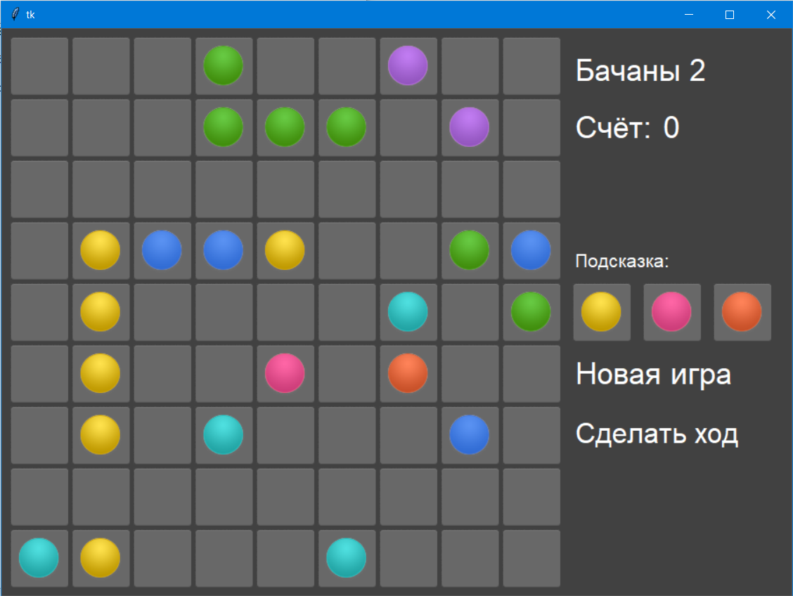
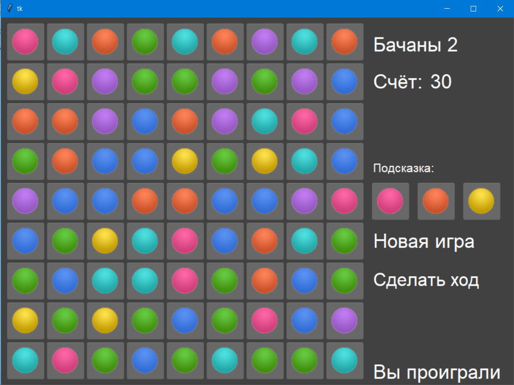

<p align="center">МИНИСТЕРСТВО НАУКИ  И ВЫСШЕГО ОБРАЗОВАНИЯ РОССИЙСКОЙ ФЕДЕРАЦИИ<br>
Федеральное государственное автономное образовательное учреждение высшего образования<br>
"КРЫМСКИЙ ФЕДЕРАЛЬНЫЙ УНИВЕРСИТЕТ им. В. И. ВЕРНАДСКОГО"<br>
ФИЗИКО-ТЕХНИЧЕСКИЙ ИНСТИТУТ<br>
Кафедра компьютерной инженерии и моделирования</p>
<br>

<h3 align="center">Отчёт по лабораторной работе № 3<br> по дисциплине "Программирование"</h3>

<br>

<br>

<p>студента 1 курса группы ПИ-б-о-202(2)<br>
Сулейманова Исы Руждиевича<br>
направления подготовки 09.03.04 "Программная инженерия"</p>

<br>

<br>

<table>
<tr><td>Научный руководитель<br> старший преподаватель кафедры<br> компьютерной инженерии и моделирования</td>
<td>(оценка)</td>
<td>Чабанов В.В.</td>
</tr>
</table>

<br>

<br>

<p align="center">Симферополь, 2020</p>
<hr>

## Цель

1. Закрепить навыки разработки программ с простым графическим интерфейсом пользователя на зыке Python при помощи библиотеки Tkinter;
2. Получить представление о разработке простых игровых приложений.

## Постановка задачи

1. Используя стандартный модуль для разработки программ с графическим интерфейсом Tkinter реализуйте игру Lines на зыке Python.
2. В качестве образца графического интерфейса была использована [данная игра](http://game-shariki.ru/linii-2).

## Выполнение работы

Моей первоночальной задачей было создать игровое поле. Оно должно состоять из объектов Label, у которых было изображение пустой плитки. Также для удобного редактирования в реальном времени все эти плитки были помещены в массив из всех плиток и к ним были также приписаны пользовательские атрибуты. Изначально плитка хранила в себе номер, строку, столбец и цвет равный -1. Когда на этой плитке появлялся шарик, атрибут, отвечающий за цвет менял своё значение. Следующим этапом было создание лейблов с названием игры, количеством очков, кнопки "Новая игра"и дальнейшим их размещением. Размещалось всё в окне с помощью метода Place библиотеки Tkinter.

Следующее, что было реализовано - функция, которая с каждым ходом размещала 3 шарика на поле. Затем было сделано так, что при нажатии на шарик его плитка становилась активной и игра переходила в состояние "Шарик выбран". При нажатии на другой шарик выбирался тот, на который нажали последним, а при нажатии на плитку размещение выбранного шарика менялось на пустую плитку, на которую мы нажали.

Следующая задача, это проверка линий. Удалялись шарики следующим образом: если игра находит больше 4 одинаковых шариков подряд(по горизонтали, вертикали или диагоналям), то шарики удалялись, а за каждый шарик даётся по 2 очка. И последнее, что должно было быть реализовано - это проверка доступности пути для шарика, но она не была реализована.ч



Рисунок 1. Демонстарция интерфейса игры.



Рисунок 2. Пользователь проиграл.

Исходный код:

```python
from tkinter import *
from PIL import Image, ImageTk
import random

def starting_game():
    global all_lbl
    global help1, help2, help3
    global x_score
    x_score = 0
    help1 = random.randint(0,6)
    help2 = random.randint(0,6)
    help3 = random.randint(0,6)
    all_lbl=[]
    lbl_num=0
    for row in range(9):
        for col in range(9):
            lbl = Label(root, image=img_tile, borderwidth=0)
            lbl.row=col
            lbl.col=row
            lbl.tile=lbl_num
            lbl.color=-1
            lbl.used=False
            lbl.bind("<Button-1>", ball_active)
            lbl.place(x=(col*70) + 10,
                      y=(row*70) + 10)
            all_lbl.append(lbl)
            lbl_num+=1

def restarting_game(event):
    global clicked
    global all_lbl
    global lbl_looser
    global img_tile
    lbl_looser=Label(root, text='                                                         ', font=('Arial', 40), bg="#414141")
    lbl_looser.place(x=650, y=600)
    all_lbl.clear()
    starting_game()
    set_balls()
    clicked=False


def check_lines_diagonal(k):
    global all_lbl
    global x_score
    same_color=[]
    i = k
    for i in range(i,81,10):
        if(i < 18):
            k = i
            same_color.append(all_lbl[i-10])
        if all_lbl[i].color == all_lbl[i-10].color:
            same_color.append(all_lbl[i])
        else:
            if len(same_color)>4 and same_color[0].color != -1:
                for j in range(len(same_color)):
                    same_color[j].config(image=img_tile)
                    same_color[j].color = -1
                    same_color[j].used = False
                    x_score += 2
            same_color.clear()
            same_color.append(all_lbl[i])
        if(i > 71) and (len(same_color)>4) and same_color[0].color != -1:
            for j in range(len(same_color)):
                    same_color[j].config(image=img_tile)
                    same_color[j].color = -1
                    same_color[j].used = False
                    x_score += 2
            same_color.clear()
    if(k < 81):
        check_lines_diagonal(k+1)
    update_score()

def check_lines_diagonal_back(k):
    global x_score
    global all_lbl
    same_color=[]
    i = k
    for i in range(i,-1,-8):
        if(i > 62 and i!=63):
            k = i
            same_color.append(all_lbl[i+8])
        if all_lbl[i].color == all_lbl[i+8].color:
            same_color.append(all_lbl[i])
        else:
            if len(same_color)>4 and same_color[0].color != -1:
                for j in range(len(same_color)):
                    same_color[j].config(image=img_tile)
                    same_color[j].color = -1
                    same_color[j].used = False
                    x_score += 2
            same_color.clear()
            same_color.append(all_lbl[i])
        if(i < 9) and (len(same_color)>4) and same_color[0].color != -1:
            for j in range(len(same_color)):
                    same_color[j].config(image=img_tile)
                    same_color[j].color = -1
                    same_color[j].used = False
                    x_score += 2
            same_color.clear()
        if(i % 9 ==8)and (len(same_color)>4) and same_color[0].color != -1:
            for j in range(len(same_color)):
                    same_color[j].config(image=img_tile)
                    same_color[j].color = -1
                    same_color[j].used = False
                    xscore += 2
            same_color.clear()
        update_score()
        if(i%9 == 8):
            break
    if(k > -1):
        check_lines_diagonal_back(k-1)

def check_lines_vertical():
    global all_lbl
    global x_score
    matrix_lbl=[]
    index = 0
    for i in range (9):
        temp =[]
        for j in range(9):
            temp.append(all_lbl[index])
            index +=1
        matrix_lbl.append(temp)
    same_color=[]
    for row in range (9):
        same_color.append(matrix_lbl[0][row])
        for col in range (1,9):
            if(matrix_lbl[col][row].color==matrix_lbl[col-1][row].color):
                same_color.append(matrix_lbl[col][row])
            else:
                if len(same_color)>4 and same_color[0].color != -1:
                    for j in range(len(same_color)):
                        same_color[j].config(image=img_tile)
                        same_color[j].color = -1
                        same_color[j].used = False
                        x_score += 2
                same_color.clear()
                same_color.append(matrix_lbl[col][row])
            if(col==8) and (len(same_color)>4) and same_color[0].color != -1:
                for j in range(len(same_color)):
                    same_color[j].config(image=img_tile)
                    same_color[j].color = -1
                    same_color[j].used = False
                    x_score += 2
                same_color.clear()
            if(col == 8):
                same_color.clear()
    update_score()
    
def check_lines_horizontal():
    global all_lbl
    global x_score
    same_color=[]
    same_color.append(all_lbl[0])
    for i in range(1,81):
        if (i%9==0) and (i!=0):
            if len(same_color)>4 and same_color[0].color!=-1:
                for j in range(len(same_color)):
                    same_color[j].config(image=img_tile)
                    same_color[j].color = -1
                    same_color[j].used = False
                    x_score+=2
            same_color.clear()
            same_color.append(all_lbl[i])
        if all_lbl[i].color == all_lbl[i-1].color:
            same_color.append(all_lbl[i])
        else:
            if len(same_color)>4 and same_color[0].color!=-1:
                for j in range(len(same_color)):
                    same_color[j].config(image=img_tile)
                    same_color[j].color = -1
                    same_color[j].used = False
                    x_score+=2
            same_color.clear()
            same_color.append(all_lbl[i])
        if(i == 80) and (len(same_color)>4) and same_color[0].color != -1:
            for j in range(len(same_color)):
                    same_color[j].config(image=img_tile)
                    same_color[j].color = -1
                    same_color[j].used = False
                    x_score+=2
            same_color.clear()
    update_score()

#def temp_matrix(all_lbl):
#    global matrix_lbl
#    matrix_lbl=[]
#    index = 0
#    for i in range (9):
#        temp =[]
#        for j in range(9):
#            temp.append(all_lbl[index])
#            index +=1
#        matrix_lbl.append(temp)
#def voln(x1,y1,x2,y2,matrix_lbl):
#        if y1 < y2:
#           print("y1<y2")
#            print(matrix_lbl[x1][y1+1].color)
#            print(matrix_lbl[x1][y1+1].tile)
#            if matrix_lbl[x1][y1+1].color == -1:
#                print("y+1")
#                return voln(x1,y1+1,x2,y2, matrix_lbl)
#        elif y1 > y2:
#            print("y1>y2")
#            print(matrix_lbl[x1][y1-1].color)
#            print(matrix_lbl[x1][y1-1].tile)
#            if matrix_lbl[x1][y1-1].color == -1:
#                    print("y-1")
#                    return voln(x1,y1-1,x2,y2, matrix_lbl)
#        if x1 < x2:
#            print("x1<x2")
#            print(matrix_lbl[x1+1][y1].color)
#            print(matrix_lbl[x1+1][y1].tile)
#            if matrix_lbl[x1+1][y1].color == -1:
#                print("x+1")
#                return voln(x1+1,y1,x2,y2, matrix_lbl)
#        elif x1 > x2:
#            print("x1>x2")
#            print(matrix_lbl[x1-1][y1].color)
#            print(matrix_lbl[x1-1][y1].tile)
#            if matrix_lbl[x1-1][y1].color == -1:
#                print("x-1")
#                return voln(x1-1,y1,x2,y2, matrix_lbl)
#        if x1 == x2 and y1 == y2:
#            return True
#        else:
#            return False
        
clicked=False
def ball_active(event):
    global clicked
    global img_tile
    global all_lbl
    global active_tile_num
    global ball_active_color
    global x1, y1
    global matrix_lbl
    global img_blue_active, img_aqua_active, img_green_active, img_pink_active, img_red_active, img_violet_active, img_yellow_active
    ball_active=[img_blue_active,img_aqua_active,img_green_active,img_pink_active,img_red_active,img_violet_active,img_yellow_active]
    global img_blue, img_aqua, img_green, img_pink, img_red, img_violet, img_yellow
    balls = [img_blue, img_aqua, img_green, img_pink, img_red, img_violet, img_yellow]
    if clicked==False:
        if event.widget.color != -1:
            event.widget.config(image=ball_active[event.widget.color])
            active_tile_num = event.widget.tile
            ball_active_color = event.widget.color
            x1 = event.widget.row
            y1 = event.widget.col
            clicked = True
    if clicked==True:
        if event.widget.color == -1:
            #if voln(x1,y1,event.widget.row,event.widget.col, matrix_lbl):
                event.widget.used = True
                all_lbl[active_tile_num].used = False
                event.widget.config(image=balls[ball_active_color])
                event.widget.color=ball_active_color
                all_lbl[active_tile_num].config(image=img_tile)
                all_lbl[active_tile_num].color = -1
                clicked=False
                set_balls()
        else:
            if event.widget.tile != active_tile_num:
                all_lbl[active_tile_num].config(image=balls[ball_active_color])
                event.widget.config(image=ball_active[event.widget.color])
                active_tile_num = event.widget.tile
                ball_active_color = event.widget.color
                
def next_move(event):
    global sum
    if sum > 78:
        return ""
    set_balls()

def update_score():
    global score, x_score
    score.config(text=x_score)
    
def set_balls():
    global all_lbl
    global help1, help2, help3
    global lbl_looser
    global sum
    global img_blue, img_aqua, img_green, img_pink, img_red, img_violet, img_yellow
    balls = [img_blue, img_aqua, img_green, img_pink, img_red, img_violet, img_yellow]
    bool=True
    while(bool):
        random_tile1 = random.randint(0,80)
        random_tile2 = random.randint(0,80)
        random_tile3 = random.randint(0,80)
        if (all_lbl[random_tile1].used==False) and (all_lbl[random_tile2].used==False) and (all_lbl[random_tile3].used==False) and (random_tile1!=random_tile2) and (random_tile1!=random_tile3) and (random_tile2!=random_tile3):
            bool=False
    x1 = all_lbl[random_tile1].row
    y1 = all_lbl[random_tile1].col
    x2 = all_lbl[random_tile2].row
    y2 = all_lbl[random_tile2].col
    x3 = all_lbl[random_tile3].row
    y3 = all_lbl[random_tile3].col
    all_lbl[random_tile1] = Label(root, image=balls[help1], borderwidth=0)
    all_lbl[random_tile1].color = help1
    all_lbl[random_tile1].row = x1
    all_lbl[random_tile1].col = y1
    all_lbl[random_tile1].tile = random_tile1
    all_lbl[random_tile1].used = True
    all_lbl[random_tile1].bind("<Button-1>", ball_active)
    all_lbl[random_tile1].place(x=all_lbl[random_tile1].row*70 + 10,y=all_lbl[random_tile1].col*70 + 10)
    all_lbl[random_tile2] = Label(root, image=balls[help2], borderwidth=0)
    all_lbl[random_tile2].color = help2
    all_lbl[random_tile2].row = x2
    all_lbl[random_tile2].col = y2
    all_lbl[random_tile2].tile = random_tile2
    all_lbl[random_tile2].used = True
    all_lbl[random_tile2].bind("<Button-1>", ball_active)
    all_lbl[random_tile2].place(x=all_lbl[random_tile2].row*70 + 10,y=all_lbl[random_tile2].col*70 + 10)
    all_lbl[random_tile3] = Label(root, image=balls[help3], borderwidth=0)
    all_lbl[random_tile3].color = help3
    all_lbl[random_tile3].row = x3
    all_lbl[random_tile3].col = y3
    all_lbl[random_tile3].tile = random_tile3
    all_lbl[random_tile3].used = True
    all_lbl[random_tile3].bind("<Button-1>", ball_active)
    all_lbl[random_tile3].place(x=all_lbl[random_tile3].row*70 + 10,y=all_lbl[random_tile3].col*70 + 10)
    print( random_tile1,all_lbl[random_tile1].row, all_lbl[random_tile1].col)
    help1,help2,help3=random.randint(0,6),random.randint(0,6),random.randint(0,6)
    help1_lbl=Label(root,image=balls[help1], borderwidth=0)
    help1_lbl.place(x=650, y=290)
    help2_lbl=Label(root,image=balls[help2], borderwidth=0)
    help2_lbl.place(x=730, y=290)
    help3_lbl=Label(root,image=balls[help3], borderwidth=0)
    help3_lbl.place(x=810, y=290)
    temp_matrix(all_lbl)
    check_lines_horizontal()        #по горизонтали
    check_lines_vertical()          #по вертикали
    check_lines_diagonal(9)         #по диагонали
    check_lines_diagonal_back(70)   #по обратной диагонали
    sum=0
    for i in range(81):
        if all_lbl[i].used==True:
            sum+=1
            if sum > 78:
                lbl_looser=Label(root, text="Вы проиграли", font=("Arial", 26), bg="#414141", fg="white")
                lbl_looser.place(x=650,y=600)

root = Tk()
root.configure(bg="#414141")
root.geometry("900x646")

tileset = Image.open("cell-bgr.png")
img_tile = ImageTk.PhotoImage(tileset.crop((1, 0, 67, 66)))
img_tile_active = ImageTk.PhotoImage(tileset.crop((1, 69, 67, 135)))

lbl_name=Label(root, text="Бачаны 2", font=("Arial", 26), bg="#414141", fg="white")
lbl_name.place(x=650, y=25)
lbl_score=Label(root, text="Счёт: ", font=("Arial", 26), bg="#414141", fg="white")
lbl_score.place(x=650, y=90)
lbl_help=Label(root, text="Подсказка: ", font=("Arial", 16), bg="#414141", fg="white")
lbl_help.place(x=650, y=250)

x_score=0
score=Label(root, text=x_score, font=("Arial", 26), bg="#414141", fg="white")
score.place(x=750, y=90)

bgr_blue = Image.open("cell-bgr.png").convert('RGBA')
ball_blue = Image.open("ball-blue.png").convert('RGBA')
bgr_blue.paste(ball_blue,(6,5),ball_blue)
img_blue = ImageTk.PhotoImage(bgr_blue.crop((1, 0, 67, 66)))

bgr_aqua = Image.open("cell-bgr.png").convert('RGBA')
ball_aqua = Image.open("ball-aqua.png").convert('RGBA')
bgr_aqua.paste(ball_aqua,(6,5),ball_aqua)
img_aqua = ImageTk.PhotoImage(bgr_aqua.crop((1, 0, 67, 66)))

bgr_green = Image.open("cell-bgr.png").convert('RGBA')
ball_green = Image.open("ball-green.png").convert('RGBA')
bgr_green.paste(ball_green,(6,5),ball_green)
img_green = ImageTk.PhotoImage(bgr_green.crop((1, 0, 67, 66)))

bgr_pink = Image.open("cell-bgr.png").convert('RGBA')
ball_pink = Image.open("ball-pink.png").convert('RGBA')
bgr_pink.paste(ball_pink,(6,5),ball_pink)
img_pink = ImageTk.PhotoImage(bgr_pink.crop((1, 0, 67, 66)))

bgr_red = Image.open("cell-bgr.png").convert('RGBA')    
ball_red = Image.open("ball-red.png").convert('RGBA')
bgr_red.paste(ball_red,(6,5),ball_red)
img_red = ImageTk.PhotoImage(bgr_red.crop((1, 0, 67, 66)))

bgr_violet = Image.open("cell-bgr.png").convert('RGBA')
ball_violet = Image.open("ball-violet.png").convert('RGBA')
bgr_violet.paste(ball_violet,(6,5),ball_violet)
img_violet = ImageTk.PhotoImage(bgr_violet.crop((1, 0, 67, 66)))

bgr_yellow = Image.open("cell-bgr.png").convert('RGBA')
ball_yellow = Image.open("ball-yellow.png").convert('RGBA')
bgr_yellow.paste(ball_yellow,(6,5),ball_yellow)
img_yellow = ImageTk.PhotoImage(bgr_yellow.crop((1, 0, 67, 66)))

bgr_blue_active = Image.open("cell-bgr.png").convert('RGBA')
ball_blue_active = Image.open("ball-blue.png").convert('RGBA')
bgr_blue_active.paste(ball_blue_active,(6,74),ball_blue_active)
img_blue_active = ImageTk.PhotoImage(bgr_blue_active.crop((1, 69, 67, 135)))

bgr_aqua_active = Image.open("cell-bgr.png").convert('RGBA')
ball_aqua_active = Image.open("ball-aqua.png").convert('RGBA')
bgr_aqua_active.paste(ball_aqua_active,(6,74),ball_aqua_active)
img_aqua_active = ImageTk.PhotoImage(bgr_aqua_active.crop((1, 69, 67, 135)))

bgr_green_active = Image.open("cell-bgr.png").convert('RGBA')
ball_green_active = Image.open("ball-green.png").convert('RGBA')
bgr_green_active.paste(ball_green_active,(6,74),ball_green_active)
img_green_active = ImageTk.PhotoImage(bgr_green_active.crop((1, 69, 67, 135)))

bgr_pink_active = Image.open("cell-bgr.png").convert('RGBA')
ball_pink_active = Image.open("ball-pink.png").convert('RGBA')
bgr_pink_active.paste(ball_pink_active,(6,74),ball_pink_active)
img_pink_active = ImageTk.PhotoImage(bgr_pink_active.crop((1, 69, 67, 135)))

bgr_red_active = Image.open("cell-bgr.png").convert('RGBA')    
ball_red_active = Image.open("ball-red.png").convert('RGBA')
bgr_red_active.paste(ball_red_active,(6,74),ball_red_active)
img_red_active = ImageTk.PhotoImage(bgr_red_active.crop((1, 69, 67, 135)))

bgr_violet_active = Image.open("cell-bgr.png").convert('RGBA')
ball_violet_active = Image.open("ball-violet.png").convert('RGBA')
bgr_violet_active.paste(ball_violet_active,(6,74),ball_violet_active)
img_violet_active = ImageTk.PhotoImage(bgr_violet_active.crop((1, 69, 67, 135)))

bgr_yellow_active = Image.open("cell-bgr.png").convert('RGBA')
ball_yellow_active = Image.open("ball-yellow.png").convert('RGBA')
bgr_yellow_active.paste(ball_yellow_active,(6,74),ball_yellow_active)
img_yellow_active = ImageTk.PhotoImage(bgr_yellow_active.crop((1, 69, 67, 135)))

lbl_new_game = Label(root,text="Новая игра", font=("Arial", 26), bg="#414141", fg="white")
lbl_new_game.bind("<Button-1>", restarting_game)
lbl_new_game.place(x=650, y=370)

lbl_next_move=Label(root,text="Сделать ход", font=("Arial", 24), bg="#414141", fg="white")
lbl_next_move.bind("<Button-1>", next_move)
lbl_next_move.place(x=650, y=440)

starting_game()
set_balls()
root.mainloop()

```


## Вывод

Закрепил навыки разработки программ на зыке Python при помощи библиотеки Tkinter. Разработал своё игровое приложение. Единственное, что выполнить не удалось - это проверка доступности пути для шарика.