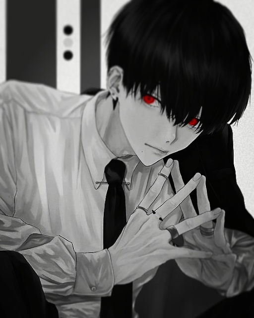

<p align="center">МИНИСТЕРСТВО НАУКИ  И ВЫСШЕГО ОБРАЗОВАНИЯ РОССИЙСКОЙ ФЕДЕРАЦИИ<br>
Федеральное государственное автономное образовательное учреждение высшего образования<br>
"КРЫМСКИЙ ФЕДЕРАЛЬНЫЙ УНИВЕРСИТЕТ им. В. И. ВЕРНАДСКОГО"<br>
ФИЗИКО-ТЕХНИЧЕСКИЙ ИНСТИТУТ<br>
Кафедра компьютерной инженерии и моделирования</p>
<br>

<h3 align="center">Отчёт по лабораторной работе № 5<br> по дисциплине "Программирование"</h3>

<br><br>

<p>студента 1 курса группы ПИ-б-о-202(2)<br>
Сулейманова Исы Руждиевича<br>
направления подготовки 09.03.04 "Программная инженерия"</p>
<br><br>

<table>
<tr><td>Научный руководитель<br> старший преподаватель кафедры<br> компьютерной инженерии и моделирования</td>
<td>(оценка)</td>
<td>Чабанов В.В.</td>
</tr>
</table>
<br><br>

<p align="center">Симферополь, 2021</p>
<hr>


## Постановка задачи

Создать десктоп приложение с GUI позволяющее сохранять текстовую информацию в изображение формата *png* без видимого изменения исходного изображения. Приложение должно позволять сохранять текст в картинку и извлекать текст из картинки.

## Выполнение работы

### Графический интерфейс

С помощью QtDesigner был создан графический интерфейс. Были созданы несколько кнопок, окно для ввода и вывода ссобщения и текстовый лейбл.


Рисунок 1. Скриншот графического интерфейса

### Программа на C++

Подключив файл с графическим интерфейсом начинаем писать код на С++. Создаём необходимые слоты в заголовочном файле, реализацию в файле ```.cpp```.  Привязываем функции к кнопкам графического интерфейса. Написав программу на C++, декодируем картинку с Ванпанчменом. Зашифрованное сообщение - Rick, GTA VI.



Рисунок 2. Зашифрованная картинка

### Программа на Python

Сделав аналогичный графический интерфейс для Python программы, пишем аналогичную программу для Python. Создаём слоты, привязываем кнопки, пишем логику.

### Вывод

В ходе выполнения данной лабораторной работы я изучил Qt Designer и базовые элементы Qt для взаимодействия и моздания приложений с GUI. Изучил сигнально-слотовую систему, как один из способов организации взаимодействия компонентов GUI. Получил практический навык работы с побитовыми операторами.